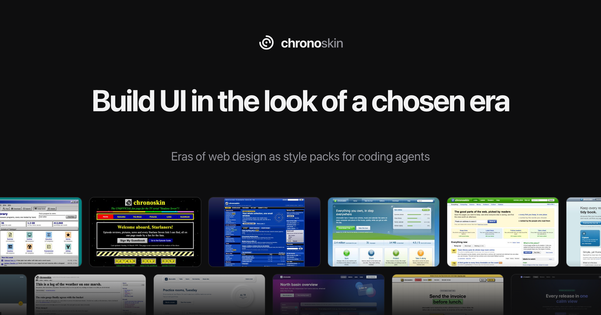

<p align="center">
  <a href="https://chrono.skin"></a>
</p>

# chronoskin

Style packs that make a coding agent build UI in the look of one era of web design, from the table layouts of 1996 to today's bento grids, instead of in its own defaults.

**[chrono.skin](https://chrono.skin)**: pick an era, generate a style, install it.

## Use it

In Claude Code, with the plugin:

```
/plugin marketplace add chronoskin/chronoskin
/plugin install chronoskin@chronoskin
/chronoskin:design-apply v1-yk-3333
```

With any agent, from a shell:

```
curl -s https://chrono.skin/s/v1-yk-3333.tar.gz | tar xzv
```

It lists the five files as it writes them into `.design/`. The folder begins with a dot, so a plain `ls` does not show it; `ls -a` does.

Then tell the agent to read `.design/STYLE.md` and `.design/specimen.html` before it writes any interface.

As an MCP server:

```
claude mcp add --transport http chronoskin https://chrono.skin/mcp
```

## What a style is

A `.design/` folder of five files in your project: the rules in words (`STYLE.md`), the tokens and components as CSS (`tokens.css`, `components.css`), a small example site to look at and copy from (`specimen.html`) and the style's identity (`style.json`).

Every style combines four parts of one era: a layout, a palette, a type set and a surface set. A Style ID such as `v1-yk-3333` names one combination, and the same ID always gives the same files.

## Run it yourself

```
make run
```

builds the library from the packs and serves the site on `http://localhost:8080`. It needs only Go 1.26. More in [docs/development.md](docs/development.md).

## Contribute

The library is plain files in `packs/`, and adding a layout or an era needs no Go. [CONTRIBUTING.md](CONTRIBUTING.md) walks through it.

## License

[MIT](LICENSE). The packs chronoskin gives you are yours to use in any project.
